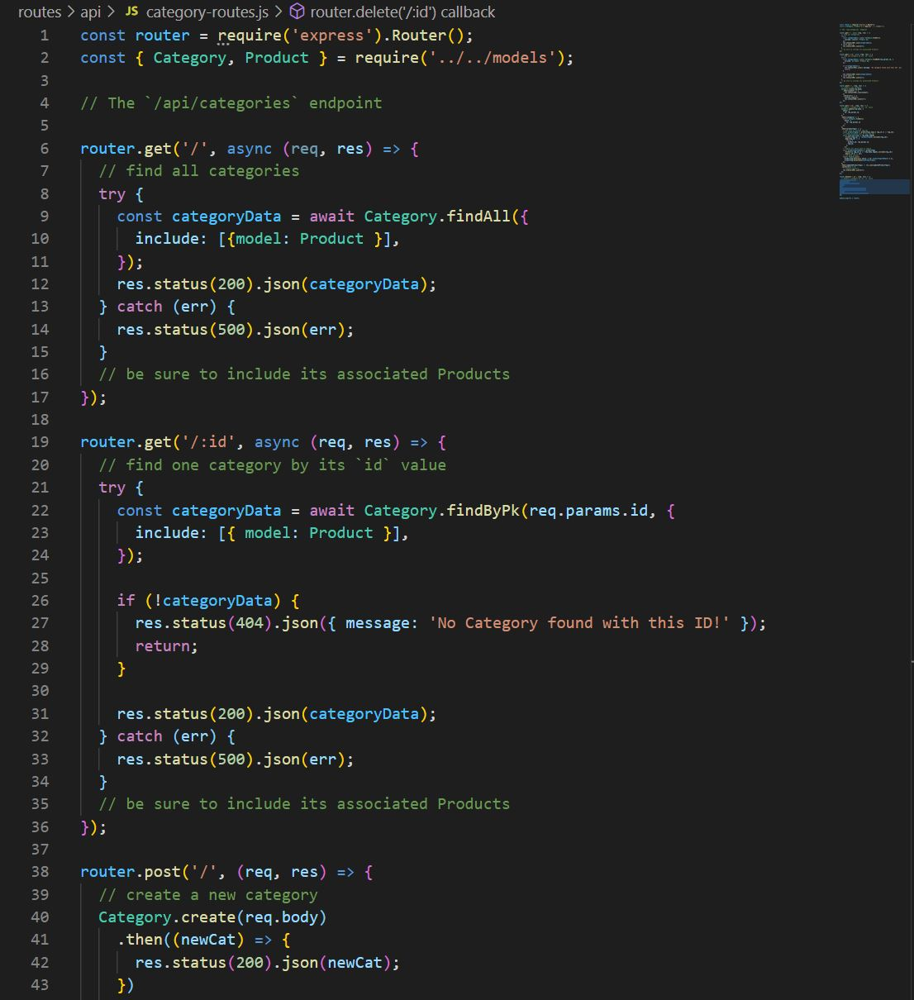
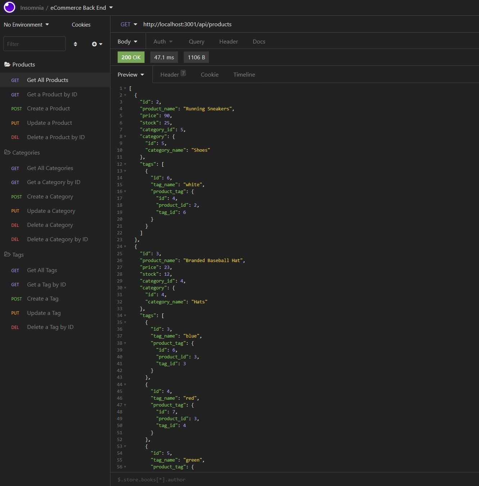

# Felixs-eCommerce-Back-End-Tool

## Description

This application was designed to funcion as a back end for a potential e-commerce company. It uses an API configuration in order to correctly route various products and their categories through the Insomnia application. Products and their corresponding category can be viewed, modified, added and deleted through Insomnia API requests. 

## Table of Contents

- [Description](#description)

- [Installation](#installation)

- [Usage](#usage)

- [Contributors](#contributors)

- [Technology](#technology)

- [Links](#links)

## Installation

The application can be ran by performing an npm installation using the "npm i" command. Following the installation, the "npm start" command or "nodemon" command can be used to launch the API server which will then take in requests through the terminal or Insomnia.

## Usage

This application can be used to easily view, create, modify or delete products and their categories. Various functions can be carried out by either using a product, category or tag id, along with viewing a list of each through the terminal or Insomnia. 

Usage and Code Examples:

## Contributors

[Felix Petzsche GitHub Link](https://github.com/felix1805).

## Technology

This application uses javascript, JEST, HTML, node.js, express routing, mysql2, node package management and inquirer. It should be viewed by launching a live server and then accessing requests through Insomnia. 

## Links

[eCommerce back-end-tool GitHub Link](https://felix1805.github.io/Felixs-eCommerce-Back-End-Tool/).
 

[Video Demostration Link for MySQL Commands](https://youtu.be/RGLwrWZaAMs).
 

[Video Demostration of Insomnia Functionality](https://youtu.be/-9iPNwTxXro).